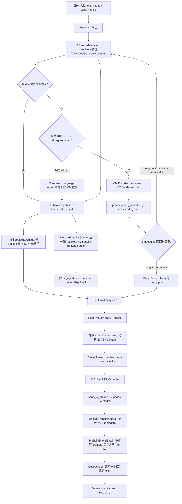
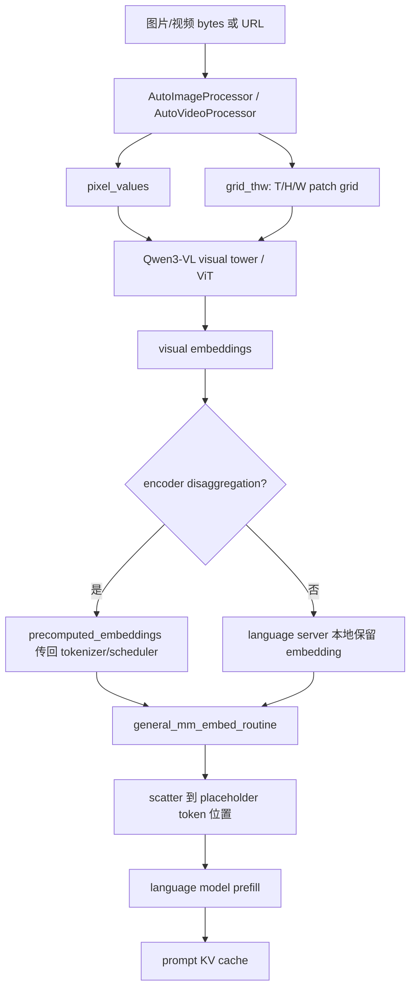
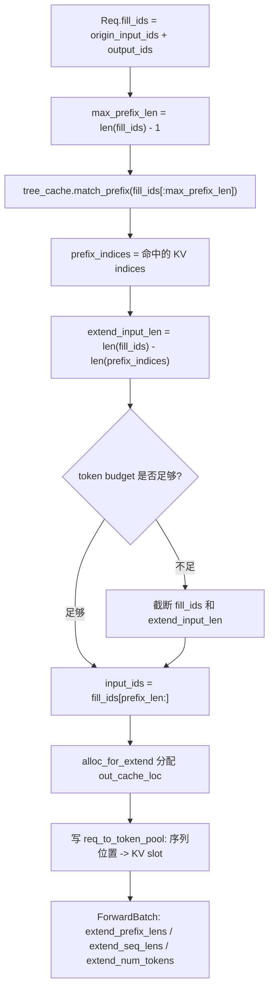
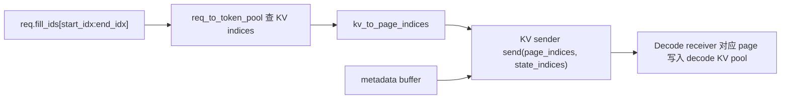
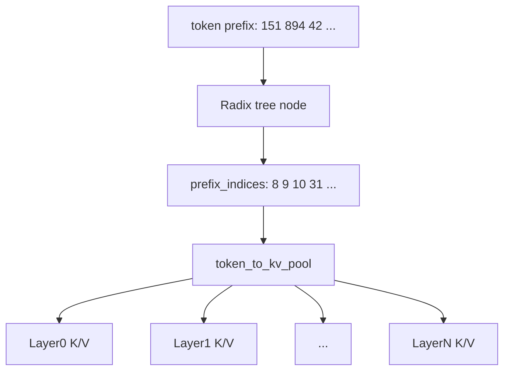
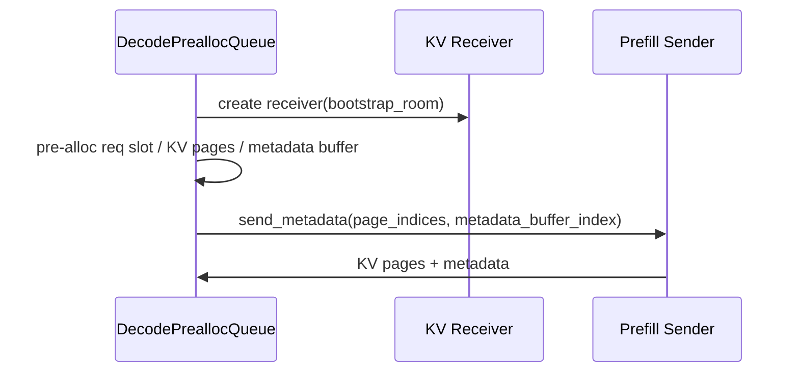
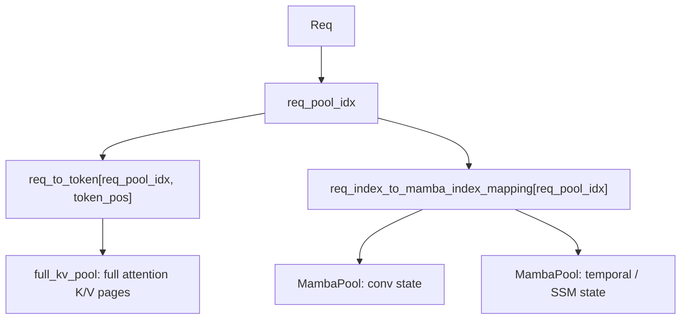
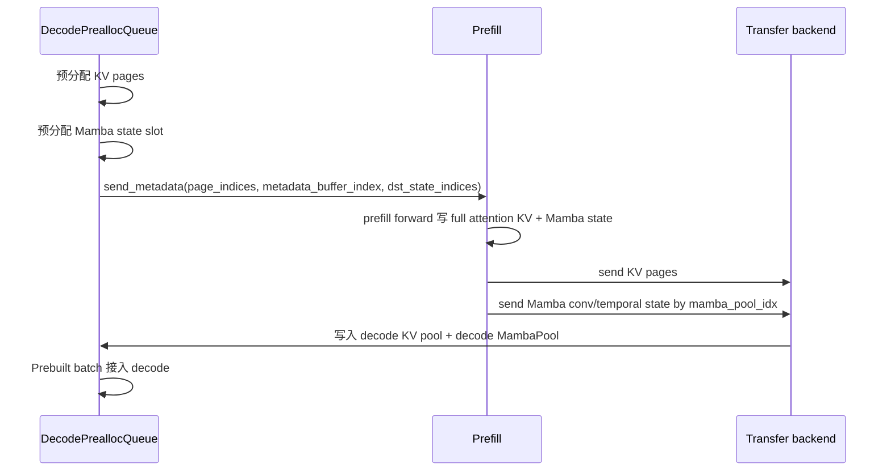

+++
title = "sglang推理流程"
date = 2026-05-28
description = "SGLang PD 分离请求生命周期：Prefill、Decode、KV Transfer、多模态 ViT 与 Radix Extend。"
categories = ["SGLang"]
tags = ["SGLang", "LLM", "PD 分离", "KV Cache", "多模态"]
draft = false
+++

## 0. 本文范围

本文只围绕 SGLang 的 PD 分离路径展开：

```text
Prefill server: 负责 prompt / extend 计算，产出 prompt 对应的 KV cache 和第一个输出 token
Decode server: 负责接收 prefill 传来的 KV cache，然后继续逐 token decode
```

多模态部分也放在这条 PD 链路里讲。因为在线上多模态 PD 部署里，图片/视频/audio 不只是 tokenizer 的事情，还会涉及：

```text
TokenizerManager
-> MM encoder / ViT
-> embedding transfer
-> Scheduler 等待或接收 mm_inputs
-> language prefill 把视觉 embedding scatter 到文本 token embedding 中
-> Prefill 计算语言模型 KV
-> Decode 接收 KV 后继续生成
```

先建立一个总图：



这张图里最容易混的几组概念是：

```text
Transformer block: 模型结构中的一层，通常是 Attention + MLP/MoE + 残差/Norm
KV cache block/page: KV cache 存储分配单位，不是 Transformer block
Radix cache: token prefix -> KV indices 的前缀索引树
extend: 当前这次 prefill 还需要真正跑 forward 的 token 数
PD transfer: Prefill 把 KV cache page 和元数据传给 Decode
MM encoder: 多模态 ViT/encoder 侧，不等于语言模型 Transformer block
```

## 1. 启动阶段：先把 Prefill 和 Decode 两类 worker 准备好

PD 分离不是一个进程里临时决定“这次做 prefill，那次做 decode”。启动时角色已经由参数决定：

```text
--disaggregation-mode prefill
--disaggregation-mode decode
--disaggregation-transfer-backend mooncake / 其他 backend
--disaggregation-bootstrap-port
--encoder-transfer-backend zmq_to_tokenizer / zmq_to_scheduler / mooncake
--language-only / --encoder-only
```

代码入口主要在：

```text
python/sglang/srt/server_args.py
python/sglang/srt/managers/scheduler.py
python/sglang/srt/disaggregation/prefill.py
python/sglang/srt/disaggregation/decode.py
python/sglang/srt/disaggregation/encode_server.py
python/sglang/srt/disaggregation/encode_receiver.py
```

### 1.1 Prefill server 启动时准备什么

Prefill 侧需要能做完整 prompt/extend forward，所以它会加载自己负责的语言模型权重分片，并初始化：

```text
distributed groups: TP / PP / DP / CP 相关通信组
ModelRunner: language model forward 运行器
req_to_token_pool: request position -> KV pool index
token_to_kv_pool: KV cache 真正存储区
tree_cache: radix cache / prefix cache
PrefillBootstrapQueue: 和 decode 侧握手
disagg_prefill_inflight_queue: KV 已发送但还没确认完成的请求
MetadataBuffers: 传输 next token、logprob、hidden state 等元数据
KV sender: 由 transfer backend 创建，负责把 KV pages 发给 decode
```

Prefill 的 event loop 在 scheduler dispatch 时进入：

```text
DisaggregationMode.PREFILL
-> event_loop_normal_disagg_prefill
-> 或 event_loop_overlap_disagg_prefill
-> 或 event_loop_pp_disagg_prefill
```

### 1.2 Decode server 启动时准备什么

Decode 侧不负责重算 prompt，它需要准备“接收 KV，然后继续 decode”的能力：

```text
DecodeReqToTokenPool: 比普通 req pool 多一块 pre-allocate headroom
token_to_kv_pool: decode 侧 KV cache 存储区
MetadataBuffers: 接收 prefill 写来的 next token / cached token 信息
DecodePreallocQueue: 握手并提前分配 KV pages
DecodeTransferQueue: 等待 KV transfer 完成
KV receiver: 由 transfer backend 创建
```

SGLang 代码里 decode 模式会强制关闭 radix cache：

```text
server_args.disaggregation_mode == "decode"
-> disable_radix_cache = True
-> "KV cache is forced as chunk cache for decode server"
```

这很关键。PD 模式下，radix/prefix 命中主要发生在 Prefill 侧；Decode 侧拿到的是 Prefill 已经算好的 KV，不应该再基于 prompt 做 prefix match 然后重算一遍。

### 1.3 并行组在启动时就决定了每个 worker 手里有什么

每个 worker 不是简单加载“完整模型的一份”。它按并行配置加载自己负责的部分：

```text
TP: 同一层的矩阵、attention head、MoE expert 权重被切到多个 rank
PP: 不同 Transformer layer/block 放在不同 pipeline stage
EP: MoE experts 分布到 expert-parallel rank
DP: 多份并行副本分担请求
CP: 长上下文 attention 的 context 维度并行
```

所以更准确的说法是：

```text
Prefill/Decode worker 启动后，各自按 TP/PP/EP/DP/CP rank 加载自己的权重分片、KV pool、通信组和传输资源。请求进来时不是再加载模型，而是在这些已经常驻的矩阵和 cache 上执行。
```

## 2. 请求进来：TokenizerManager 生成带 bootstrap 信息的请求

PD 请求需要让 Prefill 和 Decode 两边知道“这次传输要在哪里会合”。请求对象中有这些字段：

```text
bootstrap_host
bootstrap_port
bootstrap_room
bootstrap_pair_key
decode_tp_size
disagg_prefill_dp_rank
need_wait_for_mm_inputs
```

在 SGLang 里它们出现在：

```text
GenerateReqInput
TokenizedGenerateReqInput
TokenizerManager._create_tokenized_object
```

可以把 `bootstrap_room` 理解为这次 KV 传输的房间号。Prefill sender 和 Decode receiver 只要拿到同一个 room，就能对上这次请求的 KV 传输通道。

请求进入 TokenizerManager 后，先做：

```text
prompt/messages -> input_ids
sampling params -> SamplingParams
stop conditions -> stop ids / stop strings
bootstrap fields -> TokenizedGenerateReqInput
多模态输入 -> mm_inputs 或等待 encoder 返回 embedding
```

然后 TokenizerManager 把 tokenized request 发给 Scheduler。Scheduler 在 TP/CP 多 rank 下会通过 `broadcast_pyobj` 把 Python 请求对象广播给其他 rank，保证同一个调度周期里各 rank 看到一致的请求。

## 3. 多模态 PD 链路：为什么必须讲 ViT、encoder 和 broadcast

多模态请求不是“图片变成一个 token”这么简单。对 VLM 来说，图片/视频通常要先经过 vision tower，也就是常说的 ViT 或视觉 encoder，得到一串视觉 embedding，再塞进语言模型的 token 序列位置里。

在 PD 分离中，多模态至少有三层数据：

```text
原始输入: image/video/audio URL、bytes、base64、frames
processor 输出: pixel_values、grid_thw、audio feature、placeholder token、offset
encoder 输出: precomputed_embeddings，即可直接塞进语言模型的视觉 embedding
```

### 3.1 TokenizerManager 如何决定多模态走哪里

TokenizerManager 的 `_tokenize_one_request` 会先判断请求是否包含多模态输入。若包含，它会根据 server args 选择路径：

```text
language_only + encoder_transfer_backend=zmq_to_tokenizer/mooncake
-> tokenizer 侧发 encode request，等待 encoder 返回 embedding

language_only + encoder_transfer_backend=zmq_to_scheduler
-> tokenizer 只标记 need_wait_for_mm_inputs
-> scheduler 后续等待 encoder 把 embedding 发回来

没有 dispatch 到 encoder
-> tokenizer / language server 本地用 mm_processor 处理
```

还有一个自适应分支：

```text
enable_adaptive_dispatch_to_encoder
-> 根据 image/video/audio item 数量决定是否发到 encoder
```

这意味着多模态是否走独立 encoder，不是由“模型是不是 VLM”单独决定，而是由部署参数、backend、item 数量、是否 language_only 共同决定。

### 3.2 Encoder server 里真正做了什么：processor + ViT

Encoder server 的核心类是 `MMEncoder`。它启动后会加载视觉/音频相关模型组件，并初始化自己的 TP/DP attention 环境和可选的全局 embedding cache。

图片路径大致是：

```text
load image
-> AutoImageProcessor
-> pixel_values / image_grid_thw
-> model.get_image_feature 或 model.thinker.get_image_feature
-> visual tower / ViT forward
-> image embeddings
```

以 Qwen3-VL 为例：

```text
get_image_feature
-> pixel_values = cat(item.feature)
-> image_grid_thw = cat(item.image_grid_thw)
-> self.visual(pixel_values, grid_thw=image_grid_thw)
```

这一步就是视觉 encoder / ViT 计算。它输出的不是语言 token id，而是和语言模型 hidden size 对齐的 embedding 序列。

视频类似，只是多了 frame/grid/timestamp 等信息；音频则走 audio processor 和 audio feature extractor。

### 3.3 Encoder 的 broadcast 有两类

多模态 encoder 侧会出现两种容易混的 broadcast。

第一类是请求广播：

```text
encoder rank0 收到 encode request
-> 把 request 发给其他 encoder TP rank
-> 各 rank 一起完成需要并行的 ViT/encoder 计算
```

第二类是 global cache 命中状态广播：

```text
rank0 计算每个 item 的 hash
-> 查询全局 embedding cache
-> 得到 hit/miss mask
-> broadcast mask 到其他 rank
-> miss 的 item 各 rank 跑 ViT
-> hit 的 item 尝试从 global cache prefetch
-> prefetch 状态也 broadcast，失败则 fallback 到 ViT
```

所以这里的 broadcast 不是为了“让所有人都重复做一样的 CPU 活”，而是为了让多 rank 对同一批多模态 item 的处理决策一致。

### 3.4 Scheduler 侧也有多模态 broadcast

Prefill Scheduler 收到 tokenized request 后，也要让 TP/CP ranks 看到一致的请求对象：

```text
rank0 / entry rank 接收请求
-> broadcast_pyobj 到 tp_cpu_group / attn_tp_cpu_group / attn_cp_group
```

如果打开：

```text
enable_broadcast_mm_inputs_process
```

则 entry rank 会先执行：

```text
MultimodalInputs.from_processor_output(raw_mm_inputs)
```

然后把处理好的 `MultimodalInputs` 广播给其他 TP rank。这样可以避免每个 scheduler TP rank 都重复做一遍较重的 Python/CPU 多模态输入整理。

### 3.5 embedding 最终如何进入语言模型

语言模型 forward 前会走 `general_mm_embed_routine`：

```text
input_ids -> text embedding
mm_inputs -> image/video/audio embedding
placeholder/pad token mask -> 找到视觉 embedding 应该放的位置
scatter -> 把视觉 embedding 写进 input_embeds 对应位置
language_model(input_embeds)
```

如果 encoder 已经提前算好了：

```text
item.precomputed_embeddings != None
```

则 language server 不再跑 ViT，而是直接用这些 precomputed embeddings。若没有预计算 embedding，就可能在 language server 本地调用 `get_image_feature` 跑视觉 encoder。

Decode 模式下，TokenizerManager 会把多模态 item 里的大 tensor 清掉：

```text
item.feature = None
item.precomputed_embeddings = None
```

原因是 Decode server 不需要再消费这些大多模态张量。视觉信息已经在 Prefill 阶段进入语言模型，并被写入 prompt 的 KV cache。Decode 只需要接收这份 KV cache 并继续生成。

### 3.6 ViT 在这条链路里到底是什么

ViT 是视觉侧的 token mixing 模型。它处理的不是语言 token id，而是图片/视频被 processor 切出来的视觉 patch feature。

对 Qwen3-VL 这类模型，可以把视觉路径理解成：

```text
image/video 原始输入
-> image_processor / video_processor
-> pixel_values
-> image_grid_thw / video_grid_thw
-> visual tower / ViT
-> visual embeddings
-> scatter 到语言模型 input_embeds 的 placeholder 位置
-> language Transformer prefill
-> KV cache
```

其中：

```text
pixel_values: processor 产出的视觉 patch 特征，通常已经不是原始 RGB 图片
grid_thw: 每个图片/视频的 T/H/W patch 网格，用来恢复视觉 token 的时空结构
visual embeddings: 和语言模型 hidden size 对齐的向量序列
```

以 `qwen3_vl.py` 为例，图片进入视觉塔的代码形态是：

```text
pixel_values = cat(item.feature).type(self.visual.dtype)
image_grid_thw = cat(item.image_grid_thw)
self.visual(pixel_values, grid_thw=image_grid_thw)
```

视频类似，只是使用 `video_grid_thw`，还可能带 timestamp 或 second-per-grid 信息，用于多模态位置编码。



### 3.7 `grid_thw`、mRoPE 和 placeholder token 的关系

VLM 里图片不是一个 token。processor 会根据图片尺寸、patch size、merge size 得到一段视觉 token 序列。`grid_thw` 描述这段视觉 token 的时空网格：

```text
T: temporal 维度，图片通常是 1，视频是多帧/多时间片
H: height patch 数
W: width patch 数
```

语言 prompt 里原本可能只有一个 `<image>` 或若干特殊 token，但模型 forward 前会通过 `pad_input_ids` 把它扩展成足够长的 placeholder/pad token 区间：

```text
文本 token
<image placeholder 展开成 N 个视觉位置>
文本 token
```

然后 `general_mm_embed_routine -> embed_mm_inputs` 做两件事：

```text
1. 对普通文本 token 调用 embed_tokens(input_ids)
2. 对视觉 placeholder 位置，用 visual embeddings 覆盖对应 input_embeds
```

Qwen-VL 系列还会使用 mRoPE，多模态段的位置编码不是简单的一维 position，而可能是：

```text
positions.shape = (3, seq_len)
```

三维位置通常对应 temporal/height/width 结构。SGLang 在 Qwen3-VL forward 中会检查：

```text
if self.is_mrope_enabled:
    positions = forward_batch.mrope_positions
```

所以 `grid_thw` 不只是为了知道视觉 embedding 有多长，也参与多模态位置编码的构造。

### 3.8 ViT 的输出为什么还会有 deepstack

Qwen3-VL 里还有一个容易漏掉的点：ViT 输出不一定只有一份最终 visual embedding，还可能包含 deepstack visual embeddings。

代码里有：

```text
deepstack_visual_indexes
deepstack_merger_list
separate_deepstack_embeds
use_deepstack = {IMAGE: True, VIDEO: True}
```

直觉上，deepstack 是把视觉塔中间若干层的视觉特征也提取出来，经过 merger 后注入语言模型的某些 decoder layer。Qwen3-VL 的语言模型 forward 里有类似逻辑：

```text
input_embeds: 常规视觉 embedding，进入 language model 输入层
input_deepstack_embeds: 额外视觉特征，注入部分 decoder layer
```

`general_mm_embed_routine` 会在 `use_deepstack=True` 时把 deepstack 信息放进：

```text
kwargs["input_deepstack_embeds"]
```

然后语言模型 block 在指定层把 deepstack embedding 加到 hidden states/residual 路径上。

这意味着：

```text
普通 VLM 理解: 图片 embedding 只在输入层替换 placeholder
Qwen3-VL deepstack: 图片信息还可能在若干语言 decoder layer 中继续注入
```

对 PD 分离来说，这些视觉信息仍然都发生在 Prefill 侧。Decode 侧接收的是已经融合过视觉信息的 KV cache。

### 3.9 ViT CUDA graph 缓存的是什么

`ViTCudaGraphRunner` 会把视觉塔中的：

```text
blocks + merger + optional deepstack merger
```

捕获成 CUDA graph，并在相同 shape 时 replay。

它的 key 主要来自视觉序列长度：

```text
graph_key = x_3d.shape[0]
```

这里要区分两种“缓存”：

```text
MM embedding cache:
  缓存某张图片 hash 对应的 visual embedding，可跳过 ViT 计算

ViT CUDA graph cache:
  缓存某种视觉序列 shape 的执行图和稳定 buffer 地址，不缓存图片计算结果
```

所以如果两张不同图片 shape 相同：

```text
ViT CUDA graph 可以复用执行图
但 visual embedding 仍然要重新算
```

如果同一张图片 hash 命中 MM cache：

```text
可以直接复用 embedding
甚至不需要跑 ViT
```

这和 DeepGEMM 的 kernel/shape cache 类似：缓存执行方案，不等于缓存矩阵乘或 ViT 的输出结果。

### 3.10 ViT 的 DP sharding 是怎么回事

当 `use_data_parallel` 打开时，Qwen3-VL 的 `get_image_feature/get_video_feature` 不直接调用 `self.visual(...)`，而是走：

```text
run_dp_sharded_mrope_vision_model(
    self.visual,
    pixel_values,
    image_grid_thw.tolist(),
    rope_type="rope_3d",
)
```

这段逻辑会：

```text
1. 根据每张图片/video 的 patch 数计算负载
2. 把不同图片或视频 item 分配给不同 attention TP rank
3. 每个 rank 只跑自己负责的 pixel_values_local
4. 对各 rank 输出做 padding，保证 all_gather shape 对齐
5. all_gather 收集所有 rank 的 visual embeddings
6. 去掉 padding，并按原始图片顺序拼回 embedding
```

通俗理解：

```text
多图或长视频的 ViT 计算可能很重。
DP sharded vision model 不是把一张图片随便切碎，而是按 item/patch 负载把视觉 encoder 工作分到多个 rank，
最后再恢复成和原始输入顺序一致的视觉 embedding 序列。
```

这也解释了为什么 encoder 侧需要 request broadcast、mask broadcast、all_gather 等操作：ViT 不是单机纯 CPU 预处理，它本身可能就是一个多 GPU forward。

### 3.11 ViT 和 PD 的边界

在 PD 分离中，ViT 的边界可以这样记：

```text
ViT / visual tower:
  把图片/视频变成 visual embeddings

Language Prefill:
  把 visual embeddings 和文本 embeddings 融合后，跑语言模型 Transformer，生成 KV cache

Decode:
  不再看原图，不再跑 ViT，只接收 Prefill 传来的 KV cache 并继续生成
```

所以排查多模态 PD 问题时，要先判断卡在哪一段：

```text
processor 阶段: 图片加载、尺寸、frames、pixel_values、grid_thw
ViT 阶段: visual tower forward、CUDA graph、DP sharding、global embedding cache
embedding transfer 阶段: zmq_to_tokenizer / zmq_to_scheduler / mooncake
language prefill 阶段: placeholder scatter、mRoPE positions、deepstack、KV write
PD transfer 阶段: send_kv_chunk、metadata buffer、decode prebuilt
```

## 4. Prefill 侧的 radix cache：先决定哪些 token 不用重算

Prefill 收到请求后，不是永远把整个 prompt 从头算一遍。它会用 radix cache 查找最长可复用前缀。

Radix cache 的本质是：

```text
token prefix -> KV indices
```

也就是：

```text
[token_0, token_1, ..., token_n] 这段前缀
已经对应到 token_to_kv_pool 里的哪些 KV cache slot/page
```

核心代码入口：

```text
Req.adjust_max_prefix_ids
RadixCache.match_prefix
ScheduleBatch.prepare_for_extend
```

### 4.1 `fill_ids`、`prefix_indices`、`extend_input_len` 三个变量

对一个请求来说：

```text
origin_input_ids: prompt token ids
output_ids: 已经生成的 token ids
fill_ids: origin_input_ids + output_ids
prefix_indices: radix cache 命中的 KV indices
extend_input_len: 本轮真正要跑 forward 的 token 数
```

在 prefill 初始阶段，通常：

```text
fill_ids = origin_input_ids
```

如果 radix cache 命中了一段前缀：

```text
prefix_len = len(prefix_indices)
extend_input_len = len(fill_ids) - prefix_len
```

这就是“如何计算 extend”的第一层答案。

### 4.2 为什么最大 prefix 只匹配到 `input_len - 1`

`adjust_max_prefix_ids` 里会把最大可匹配长度限制成：

```text
max_prefix_len = input_len - 1
token_ids = fill_ids[:max_prefix_len]
```

直觉解释：

```text
即使整个 prompt 都在 cache 里，也至少要留下最后一个 token 做一次 forward，
因为模型需要基于最后位置的 hidden state 产生 logits，采样出下一个 token。
```

所以：

```text
prompt 长度 100，radix 最多命中 99
extend_input_len 至少是 1
```

除非是某些特殊 forward mode 或内部优化路径，不要把“cache 全命中”理解成 prefill 彻底没有模型计算。

### 4.3 extend 的例子

例 1：没有 prefix cache 命中。

```text
prompt length = 100
prefix_len = 0
extend_input_len = 100
本轮 prefill 要跑 100 个 token
```

例 2：命中 70 个 token。

```text
prompt length = 100
prefix_len = 70
extend_input_len = 30
本轮只跑后 30 个 token
前 70 个 token 的 KV 直接复用
```

例 3：几乎全命中。

```text
prompt length = 100
max_prefix_len = 99
prefix_len = 99
extend_input_len = 1
本轮只跑最后 1 个 token，用它产生 next token 的 logits
```

例 4：chunked prefill 截断。

```text
prompt length = 100
prefix_len = 20
理论 extend_input_len = 80
当前 token budget 只允许 16
本轮 extend_input_len 被截成 16
fill_ids 临时截成 prefix_len + 16
后续调度轮次继续 extend 剩余 token
```

所以 extend 不是“prompt 剩余长度”的固定值，它会同时受：

```text
radix cache 命中长度
调度 token budget
chunked prefill size
logprob 需求
HiCache / host cache loadback
多模态 placeholder 展开后的真实 token 长度
```

影响。

### 4.4 从 radix 到 EXTEND batch 的数据流



`ScheduleBatch.prepare_for_extend` 做的事可以简化为：

```text
input_ids = r.fill_ids[len(r.prefix_indices):]
extend_num_tokens = sum(len(input_ids) for each req)
seq_lens = len(r.fill_ids)
prefix_lens = len(r.prefix_indices)
extend_lens = r.extend_input_len
out_cache_loc = alloc_for_extend(...)
```

`out_cache_loc` 是本轮新算出来的 token 要写入 KV cache 的位置。已有 prefix 的 KV indices 直接来自 radix cache，不需要重新分配。

## 5. Prefill forward：Transformer block 真的在做什么

当 EXTEND batch 准备好后，Prefill worker 才进入模型 forward。

对 decoder-only LLM 来说，主干流程是：

```text
input_ids / input_embeds
-> token embedding
-> for each Transformer block:
     RMSNorm / LayerNorm
     Attention token mixing
     residual add
     RMSNorm / LayerNorm
     MLP 或 MoE
     residual add
-> final norm
-> lm_head
-> logits
-> sampler 得到 next token
```

这里的 block 是模型结构上的一层。一个 80 层模型，就是有 80 个类似的 block。每个 block 里通常有两个大模块：

```text
Attention: token mixing，让当前位置读历史 token 信息
MLP/MoE: channel mixing，对每个 token 自己的 hidden 维度做非线性变换
```

### 5.1 Attention 里的 Q/K/V

对一个 token hidden state `x`：

```text
q = x @ Wq
k = x @ Wk
v = x @ Wv
```

prefill 阶段一次处理 prompt/extend 的多个 token，因此会算出一批 Q/K/V：

```text
Q: 当前要算的 token 用来发起查询
K/V: 当前 token 写入 KV cache，供自己和后续 decode 使用
```

attention 的核心是：

```text
score = Q @ K^T
weight = softmax(score + causal_mask)
context = weight @ V
out = context @ Wo
```

在推理实现里经常把：

```text
q_proj / k_proj / v_proj
```

合并成：

```text
qkv_proj
```

这只是把三次矩阵乘变成一次更大的矩阵乘，数学含义仍然是 Q/K/V 三组投影。

### 5.2 MLP 原本计算哪一部分

Transformer 原本就有 MLP，也常叫 FFN。它不是外加概念，而是每个 block 里的标准组成部分。

以 SwiGLU MLP 为例：

```text
gate = x @ W_gate
up   = x @ W_up
mid  = silu(gate) * up
out  = mid @ W_down
```

推理实现里常把：

```text
gate_proj / up_proj
```

合并成：

```text
gate_up_proj
```

这和 qkv_proj 类似，是把两个线性投影合并成一次大 GEMM，方便 kernel 执行，语义仍然是 gate 和 up 两条分支。

### 5.3 MoE 为什么主要作用在 MLP

MoE 通常替换的是 Transformer block 里的 MLP/FFN，而不是 attention。原因是：

```text
Attention 负责 token mixing，所有 token 之间的信息交互依赖它
MLP 主要是每个 token 独立做 channel mixing，天然适合按 token 分流
```

MoE block 里通常是：

```text
router/gate: 为每个 token 选择 top-k experts
experts: 多个小/中等 MLP
combine: 按 gate weight 加权合并 expert 输出
```

对单个 token 来说：

```text
dense MLP: 经过一套大 MLP
MoE MLP: 只经过 top-k 个 expert MLP，不经过全部 experts
```

如果一个 MoE 模型已经训练好了，模型权重天然就是：

```text
shared attention
router/gate
expert_0 MLP
expert_1 MLP
...
expert_N MLP
```

不是 serving 时临时把 dense MLP 切成 experts。

### 5.4 EP 在这条链路里影响哪里

EP 只影响 MoE experts 的放置和 token dispatch：

```text
每个 token 先在本层 router 得到 top-k expert id
如果目标 expert 在本卡，直接本地算
如果目标 expert 在其他 EP rank，token hidden state 通过 all-to-all / dispatch 发过去
远端 expert 算完后再 combine / gather 回来
```

所以 EP 的价值不是“把一个 dense MLP 自动变小”，而是：

```text
MoE 模型总 experts 很多，单卡放不下或不适合全量计算
EP 让不同 GPU 承载不同 experts
每个 token 只激活 top-k experts
跨卡 dispatch 换来总参数容量和单 token 稀疏计算
```

如果某个 expert 本身的计算量和 dense MLP 一样大，EP 仍然能解决“专家总数太多，单卡放不下”的问题，但单 token 计算不会因为 EP 自己变小。EP 的收益来自模型本身是 sparse MoE，而不是来自打开 EP 这个开关。

## 6. Prefill 写 KV cache：写在哪里，之后怎么传

Prefill forward 每经过一个 attention layer，就会把本轮 extend token 的 K/V 写入 KV cache。

SGLang 中有两层映射：

```text
req_to_token_pool:
  req_pool_idx + token position -> token_to_kv_pool index

token_to_kv_pool:
  token_to_kv_pool index -> 真实 K/V tensor 存储
```

本轮新算的 token 用 `out_cache_loc` 写入；已经命中的 prefix token 用 `prefix_indices` 复用。

可以理解为：

```text
序列逻辑位置: 0 1 2 3 4 5 6 ...
KV 物理位置: 8 9 10 31 32 45 ...
```

radix cache 记录的是“某段 token prefix 对应哪些 KV 物理位置”，request pool 记录的是“当前请求每个序列位置对应哪个 KV 物理位置”。

### 6.1 Prefill 为什么要 `cache_unfinished_req`

PD prefill 算完一个请求后，不是立刻把 KV 释放掉。它还要把 KV 传给 decode。

因此 prefill 结果处理里会做：

```text
tree_cache.cache_unfinished_req(req)
send_kv_chunk(req, last_chunk=True)
把 req 放入 disagg_prefill_inflight_queue
```

`cache_unfinished_req` 的作用是：

```text
把当前已算出的 prompt KV 插入 radix tree
锁住相关 cache 节点，避免传输完成前被驱逐或释放
更新 req.prefix_indices，让后续 cache/release 逻辑知道哪些 KV 已经挂到树上
```

等 KV transfer 确认成功后，prefill 才会：

```text
release_kv_cache(req, tree_cache)
释放 metadata buffer
向客户端/上游返回本次 prefill 产出的第一个 token
```

### 6.2 `send_kv_chunk` 传的是什么

Prefill 发送的不是 token id，而是 KV cache page 的索引和必要元数据。

核心数据包括：

```text
start_idx / end_idx: 这次发送 fill_ids 的哪一段
kv_indices: req_to_token_pool 中对应 token position 的 KV pool indices
page_indices: kv_indices 按 page_size 转成 page 粒度
state_indices: hybrid Mamba / SWA / NSA 等特殊 cache state
metadata buffer: next token、logprob、hidden states、cached token 信息等
last_chunk: 是否最后一个 KV chunk
```

如果不是最后一个 chunk，SGLang 会把 end 对齐到 page 边界，避免传输半页 KV。



### 6.3 KV cache 和 radix cache 的关系

KV cache 是数据本体：

```text
每层 attention 的 K/V tensor
```

Radix cache 是索引结构：

```text
token prefix -> KV cache indices
```

两者关系像这样：



Radix cache 不保存完整 hidden states，也不保存 logits。它只是让 Prefill 知道哪些 token 的 KV 已经存在，可以跳过重算。

## 7. Prefill queue 生命周期

Prefill 侧有三段主要队列：

```text
PrefillBootstrapQueue
waiting_queue
disagg_prefill_inflight_queue
```

### 7.1 BootstrapQueue：先和 Decode 对上

PrefillBootstrapQueue 收到请求后，会创建 KV sender：

```text
bootstrap_addr = bootstrap_host:bootstrap_port
bootstrap_room = req.bootstrap_room
dest_tp_ranks = [self.tp_rank]
pp_rank = self.pp_rank
```

然后持续 poll sender 状态：

```text
KVPoll.Bootstrapping
-> 继续等待握手

KVPoll.WaitingForInput
-> Decode 已经准备好接收
-> Prefill 分配 metadata buffer
-> sender.init(num_pages, metadata_buffer_index)
-> 请求进入 waiting_queue

KVPoll.Failed
-> abort
```

### 7.2 waiting_queue：做 radix/extend，然后跑模型

进入 waiting_queue 后，调度器会：

```text
计算 prefix cache 命中
计算 extend_input_len
按 token budget / chunked prefill 策略选择一批请求
构造 ScheduleBatch
prepare_for_extend
ModelRunner.forward
```

Prefill 侧的 forward mode 本质上是 EXTEND：它处理 prompt 中未被 radix cache 覆盖的那段 token。

### 7.3 inflight_queue：KV 已发出，但还不能释放

模型 forward 完成后：

```text
采样出 next_token_id
把 next_token_id 放入 req.output_ids
cache_unfinished_req
send_kv_chunk
进入 inflight_queue
```

inflight_queue 持续 poll sender：

```text
WaitingForInput / Transferring
-> 继续等

Success
-> transfer done
-> release KV cache / tree lock
-> 清理 sender 和 metadata buffer
-> 返回或 stream 第一个 token

Failed
-> abort
```

所以 Prefill 的最终产物有两份：

```text
一份大数据: prompt 对应的 KV cache pages
一份小元数据: 第一个输出 token、logprob、hidden state 等
```

Decode 两份都需要。

## 8. Decode queue 生命周期：接收 KV，然后接入 running batch

Decode 侧队列主要是：

```text
DecodePreallocQueue
DecodeTransferQueue
waiting_queue
running_batch
```

### 8.1 PreallocQueue：先把接收空间准备好

Decode 侧拿到请求后，会创建 KV receiver 并进入 prealloc：

```text
解析 prefill dp rank
检查 req pool 是否有空位
检查 metadata buffer 是否有空位
估算需要的 token 数 = origin_input_len + reserved decode tokens
预分配 decode 侧 KV pages
把 page_indices / metadata_buffer_index 发给 prefill
```

这一步很重要：Prefill 发送 KV 时，需要知道 Decode 侧要把这些 pages 写到哪里。



### 8.2 TransferQueue：等 KV 真正到达

DecodeTransferQueue 负责 poll receiver：

```text
Bootstrapping / WaitingForInput / Transferring
-> 继续等待

Success
-> _commit_transfer_to_req
-> 从 metadata buffer 读取 output_id / cached_tokens / logprobs / hidden_states
-> 把 prefill 采样出的 output_id append 到 req.output_ids
-> 请求进入 waiting_queue

Failed
-> abort
```

这里的关键点是：

```text
Decode server 不会重新跑 prompt prefill。
它接收的是 Prefill 已经算好的 KV cache，并通过 metadata 知道第一个 token 是什么。
```

### 8.3 PrebuiltExtendBatch：为什么叫“prebuilt”

Decode 收到 KV 后，还要把这个请求接入调度器内部的数据结构。SGLang 通过：

```text
get_new_prebuilt_batch
prepare_for_prebuilt
process_prebuilt
```

构造一个 `PrebuiltExtendBatch`。

它的作用不是再算 prompt，而是把“已经完成 prefill 的请求”补进 decode 侧 batch 状态：

```text
req_to_token_pool 已经有 prompt 的 KV 映射
token_to_kv_pool 已经有 Prefill 传来的 KV
metadata 里已经有第一个 output token
decode 下一步只需要基于当前序列继续生成
```

之后请求进入 running batch，执行标准 decode loop：

```text
每步输入上一个 token
attention 读历史 KV cache
写入当前 token 的 K/V
MLP/MoE
logits
sampler
```

## 9. PD 中 KV cache 的分配和传输如何受 TP/PP/EP 影响

### 9.1 TP：每个 rank 传自己那份 KV

TP 会把 attention head 或 hidden 维度切到不同 rank。于是 KV cache 本身也是按 TP rank 分片的。

在 PD transfer 中：

```text
Prefill TP rank i 算出自己的 KV shard
Decode TP rank i 预分配自己的 KV page
sender/receiver 按 rank 对接
poll 状态通过 TP/CP 相关 group 做同步
```

所以不是“一个 rank 把完整 KV 传给所有 decode rank”，而是每个参与 rank 传自己负责的那份。

### 9.2 PP：每个 pipeline stage 只传自己 layer 的 KV

PP 把不同 layer/block 放到不同 stage。KV cache 是按 layer 存的，所以：

```text
PP stage 0 只拥有前几层的 KV
PP stage 1 只拥有后几层的 KV
...
每个 stage 需要传自己负责 layer 的 KV
```

这也是为什么 PD 代码里 sender/receiver 会带 `pp_rank`，并且 scheduler dispatch 有专门的 PP disagg event loop。

### 9.3 EP：只影响 MoE MLP，不直接改变 KV transfer 结构

EP 的作用点在 MoE MLP：

```text
router 选 expert
token hidden state dispatch 到 expert 所在 rank
expert MLP 计算
结果 gather/combine
```

KV cache 来自 attention 的 K/V，不来自 MLP expert。因此 EP 不会像 TP/PP 那样天然决定“KV cache 按哪些 attention shard/layer 来传”。它主要影响 forward 中 MoE 阶段的通信和 GEMM 形态。

这也是“为什么专家并行只作用于 MLP”的实践答案：

```text
MoE expert 本质就是很多个 MLP/FFN 分支；
attention 的 K/V cache 和 token mixing 仍是共享注意力路径；
所以 EP 是 MoE MLP 的并行，不是 KV cache 的并行轴。
```

## 10. DeepGEMM 在这条链路中主要在哪里

DeepGEMM 是高性能 GEMM kernel/运行时，用来高效执行某些矩阵乘，尤其常见于 FP8、MoE grouped GEMM 等场景。

在模型 forward 里，矩阵乘无处不在：

```text
qkv_proj: x @ Wqkv
o_proj: context @ Wo
gate_up_proj: x @ W_gate_up
down_proj: mid @ W_down
MoE experts: token group @ expert weights
lm_head: hidden @ vocab_weight
```

对 MoE 来说，一批 token 会被 router 分到不同 experts。直接逐 expert 启动很多小 GEMM 会浪费 kernel launch 和 GPU 利用率。Grouped GEMM 会把多个 expert 的矩阵乘组织在一起执行：

```text
expert_3: 12 tokens x W3
expert_7: 5 tokens x W7
expert_11: 23 tokens x W11
...
-> grouped GEMM kernel 一次或少数几次调度
```

“GEMM 更大”的通俗理解是：

```text
GPU 不喜欢很多零碎小活。
把多个 expert 的小矩阵乘打包成一个更连续、更饱满的矩阵乘任务，
SM 更容易吃满，访存和调度开销也更划算。
```

DeepGEMM 说的 cache 不是“缓存某个矩阵的计算结果”。矩阵乘结果依赖输入 token hidden state，请求不同、token 不同，结果也不同，不能直接缓存。

它缓存的更像是：

```text
某种 GEMM 形状 / dtype / layout / tiling / schedule 对应的 kernel 或调优配置
```

也就是：

```text
下次又遇到类似 M/N/K、FP8 layout、expert 分组形状时，
不用重新编译或重新搜索调优参数，直接复用已准备好的执行方案。
```

## 11. Hybrid Mamba / Attention token mixing 怎么放进这个理解里

Transformer block 里负责跨 token 信息流动的模块叫 token mixing。标准 decoder-only Transformer 用 attention 做 token mixing。

Mamba 类模型用 state space / selective scan 做 token mixing。混合模型则可能是：

```text
某些 block: Attention token mixing + MLP/MoE
某些 block: Mamba token mixing + MLP/MoE
```

这里的 block 仍然是模型层。区别是这个层的“跨 token 混合模块”不是都用 attention。

对 KV cache 的影响是：

```text
Attention block 需要 K/V cache
Mamba block 不一定有传统 K/V cache，而是有 state cache
```

所以 SGLang PD transfer 里会看到：

```text
HybridLinearKVPool / Mamba state
SWA window page indices
NSA state page indices
state_indices
state_data_ptrs
state_type
```

这表示 PD 传输不只是简单传 attention K/V。对 hybrid 模型，还要把对应层需要的 state 一并协调好。

### 11.1 Attention 和 Mamba 的计算方式差别

Attention 的核心是“当前 token 去看所有历史 token”：

```text
Q = x @ Wq
K = x @ Wk
V = x @ Wv
score = Q @ K^T
context = softmax(score) @ V
```

因此推理时要保存历史 token 的 K/V：

```text
KV cache 规模随 seq_len 增长
每多一个 token，每个 attention layer 都要追加一份 K/V
```

Mamba/SSM 的思路更像“把历史压进一个递推状态里”：

```text
当前输入 x_t
-> 生成输入相关的 delta/B/C 等参数
-> 更新 recurrent state
-> 输出当前 token 的 mixed hidden state
```

在 SGLang 的 `MambaMixer2` 里，可以看到这条路径：

```text
in_proj(hidden_states)
-> split gate / hidden_states_B_C / dt
-> causal conv 更新 conv_state
-> split hidden_states / B / C
-> mamba_chunk_scan_combined 更新 temporal SSM state
-> 输出 token mixing 结果
```

所以：

```text
Attention: 保存很多历史 token 的 K/V，decode 时读这些 K/V
Mamba: 保存每个请求的 conv state + temporal/SSM state，decode 时更新这个 state
```

### 11.2 Mamba block 里是不是没有 MLP

不是。Mamba 替换的是 block 里的 token mixing 模块，不是替换整个 block。

典型 hybrid block 仍然是：

```text
Norm
-> Attention 或 Mamba/linear attention
-> residual
-> Norm
-> MLP 或 MoE
-> residual
```

以 Qwen3Next 的 `Qwen3HybridLinearDecoderLayer` 为例：

```text
linear_attn = Qwen3GatedDeltaNet(...)
mlp = Qwen2MoeSparseMoeBlock(...)
```

forward 里先跑 `linear_attn`，再跑 MoE MLP。这和普通 Transformer block 的结构位置是对齐的，只是 attention 那个 token mixing 模块换成了 linear/Mamba 类模块。

SGLang 代码里能看到几类相关模型：

```text
FalconH1 / NemotronH / GraniteMoeHybrid:
  直接使用 MambaMixer2

Qwen3Next:
  layers_block_type 在 attention 和 linear_attention 之间切换
  linear_attention 层走 Qwen3GatedDeltaNet
  仍复用 Mamba2 风格的 state/cache 管理接口

LFM2:
  某些 conv / short_conv 层使用 MambaPool 保存状态
```

所以文档里说 “Mamba” 时，实际可以理解成更宽泛的一类：

```text
不是为每个历史 token 保存 K/V，
而是为每个请求在每个线性状态层保存一个可递推的 state。
```

### 11.3 Mamba cache 和 KV cache 的区别

SGLang 里 Mamba state 主要放在 `MambaPool`：

```text
MambaPool.State:
  conv: List[Tensor]
  temporal: Tensor

MambaPool.SpeculativeState:
  conv
  temporal
  intermediate_ssm
  intermediate_conv_window
```

可以粗略理解成：

```text
conv state:
  保存因果卷积需要的最近窗口输入

temporal / SSM state:
  保存 selective scan 的递推状态

intermediate state:
  speculative decoding / target verify 时用来保存草稿 token 的中间状态
```

启动时，如果模型是 hybrid Mamba，SGLang 会单独给 Mamba state 留显存：

```text
max_mamba_cache_size
mamba_full_memory_ratio
mamba_cache_per_req
```

`handle_max_mamba_cache` 会把剩余显存拆成两类：

```text
一部分给 full attention KV cache
一部分给 Mamba state cache
```

这就是为什么 hybrid Mamba 模型不是只有 `max_total_num_tokens` 一个 cache 容量问题，还会有 `max_mamba_cache_size` 这条线。

### 11.4 HybridLinearKVPool：为什么既有 KV 又有 MambaPool

Hybrid 模型里不是每层都是 Mamba。比如一部分层是 full attention，一部分层是 Mamba/linear attention。

因此 SGLang 用 `HybridLinearKVPool` 同时管理两类 cache：

```text
full_kv_pool:
  只为 full_attention_layer_ids 保存 K/V

mamba_pool:
  为 mamba/linear state layers 保存 conv/temporal state
```

对应的 request pool 是 `HybridReqToTokenPool`：

```text
req_to_token:
  request position -> full attention KV slot

req_index_to_mamba_index_mapping:
  req_pool_idx -> mamba_pool_idx
```

这表示一个请求同时有两种“物理位置”：

```text
token 位置 -> KV pool index，用于 attention layers
request 位置 -> Mamba state index，用于 Mamba/linear layers
```



### 11.5 Mamba 与 radix cache 的关系

普通 attention radix cache 保存的是：

```text
token prefix -> KV indices
```

Mamba 不为每个 token 保存 K/V，所以不能只复用 `prefix_indices` 就完事。对于 Mamba，prefix cache 还需要知道：

```text
这个 prefix 末尾对应的 Mamba state 在哪里
```

SGLang 的 `Req` 里有这些字段：

```text
mamba_pool_idx
mamba_ping_pong_track_buffer
mamba_last_track_seqlen
mamba_branching_seqlen
```

它们服务于两个需求：

```text
1. radix 命中 prefix 后，后续 extend 要从正确的 Mamba state 接着算
2. chunked prefill 时，需要在某些对齐边界保存可复用的 Mamba state
```

如果开启 `mamba_scheduler_strategy=extra_buffer`，`prepare_for_extend` 会生成：

```text
mamba_track_indices
mamba_track_mask
mamba_track_seqlens
```

这些字段告诉 Mamba backend：

```text
这次 extend 完成后，哪些请求需要把当前 state 复制到可被 radix cache 复用的 track buffer
```

为什么要对齐？因为 Mamba/FLA kernel 内部按 chunk 处理，代码里会围绕：

```text
mamba_cache_chunk_size
FLA_CHUNK_SIZE
page_size
```

计算哪些 state 能安全作为 prefix cache 的边界。

直觉上：

```text
Attention prefix cache:
  prefix 到第几个 token，就能拿到这些 token 的 K/V

Mamba prefix cache:
  prefix 到某个边界，还要保存这个边界处的 recurrent state
  下次从这个 state 继续 scan，而不是从头 scan
```

### 11.6 Mamba 在 PD transfer 里怎么传

PD transfer 对纯 attention 模型主要传：

```text
page_indices -> KV pages
metadata buffer -> next token / logprob / hidden states 等
```

对 hybrid Mamba 模型，还要传 Mamba state。SGLang 初始化 KV manager 时会检查：

```text
if hasattr(token_to_kv_pool, "get_state_buf_infos"):
    kv_args.state_data_ptrs = ...
    kv_args.state_data_lens = ...
    kv_args.state_item_lens = ...

if isinstance(token_to_kv_pool, HybridLinearKVPool):
    kv_args.state_type = "mamba"
```

这里的 `state_data_ptrs` 指向 MambaPool 中的 conv/temporal state buffer。`state_type=mamba` 告诉 transfer backend：除了 KV pages，还要按 Mamba state 的布局传 state。

Prefill 侧 `send_kv_chunk` 在最后一个 chunk 会设置：

```text
state_indices = [
  req_to_token_pool.req_index_to_mamba_index_mapping[req.req_pool_idx]
]
```

Decode 侧 `DecodePreallocQueue` 也会为目标请求准备一个 decode-side mamba state index，并通过 `send_metadata` 送给 prefill：

```text
page_indices
metadata_buffer_index
state_indices
```

所以 hybrid Mamba 的 PD 传输是：



Mooncake 里针对 Mamba 有专门路径：

```text
state_type == "mamba"
-> _send_mamba_state
-> 或 prefill/decode TP size 不同时 _send_mamba_state_slice
```

Mamba state layout 的 TP 切分点主要在第三维：

```text
conv_state:
  [num_layers, size+1, conv_dim/tp, conv_kernel-1]

temporal_state:
  [num_layers, size+1, num_heads/tp, head_dim, state_size]
```

因此当 prefill 和 decode 的 attention TP size 不一样时，Mamba state 不能简单整块复制，需要按 TP slice 转换。这也是为什么 SGLang 传 `state_dim_per_tensor` 和 `state_segment_dims_per_tensor`。

### 11.7 Decode 阶段 Mamba 怎么继续

Decode 接收完 KV + Mamba state 后，后续每步生成时：

```text
Attention layer:
  读历史 KV cache
  追加当前 token 的 K/V

Mamba layer:
  读当前请求的 conv/temporal state
  用当前 token 更新 state
  输出当前 token hidden state
```

Mamba backend 会通过：

```text
mamba_cache_indices = req_to_token_pool.get_mamba_indices(req_pool_indices)
```

找到每个请求对应的 Mamba state slot。`Mamba2Metadata` 则把 continuous batching、chunked prefill、decode 的元数据统一起来：

```text
num_prefills
num_prefill_tokens
num_decodes
query_start_loc
mamba_cache_indices
mixed_metadata
```

这也是 Mamba 在 serving 里复杂的地方：它不是简单“没有 KV cache 所以更简单”，而是把历史状态从 per-token KV 变成了 per-request recurrent state，并且 continuous batching、chunked prefill、radix cache、spec decode 都要维护这个 state 的正确性。

### 11.8 Mamba 与 Attention 的心智对照表

| 维度 | Attention | Mamba / SSM / Linear state |
| --- | --- | --- |
| token mixing 方式 | 当前 token attend 历史 K/V | 当前 token 更新递推 state |
| cache 本体 | 每层每个历史 token 的 K/V | 每层每个请求的 conv/temporal state |
| cache 增长 | 随 seq_len 增长 | 主要随请求数和层数增长 |
| radix 命中后 | 复用 prefix 对应 KV indices | 还要复用 prefix 边界的 Mamba state |
| PD 传输 | 传 KV pages | 传 KV pages + Mamba state |
| TP 影响 | K/V head 或 hidden shard | state 第三维按 TP slice |
| decode 每步 | 读历史 KV，追加新 K/V | 读 state，更新 state |
| 复杂点 | KV 容量和 attention backend | state 对齐、chunk boundary、extra buffer、spec decode |

### 11.9 放回一次 PD 请求里

如果模型是 hybrid attention + Mamba，一次 PD 请求里会发生：

```text
1. Prefill 启动时创建 HybridLinearKVPool 和 MambaPool。
2. Decode 启动时创建 HybridMambaDecodeReqToTokenPool，留出 prealloc headroom。
3. 请求进入 Prefill waiting_queue 后，radix 先匹配 full attention prefix。
4. 如果启用 Mamba radix/extra buffer，还会准备 mamba_track_* 信息。
5. Prefill forward 中，attention 层写 KV，Mamba 层更新 conv/temporal state。
6. Prefill 最后一个 chunk 调用 send_kv_chunk，同时携带 mamba state index。
7. Decode 已经预分配 KV pages 和 Mamba state slot，并把目标 state index 发给 Prefill。
8. Transfer backend 把 full attention KV 和 Mamba state 都写到 Decode 侧。
9. Decode 构造 Prebuilt batch，不重算 prompt，后续每个 decode step 同时维护 KV cache 与 Mamba state。
```

这就是 “PD 传 KV cache” 在 hybrid Mamba 模型里的完整含义：不是只有 attention KV，还包括 Mamba/linear 层继续 decode 所必需的 recurrent state。

## 12. 把完整请求流程压成一条可执行心智模型

下面是一条从请求到输出的完整 PD 心智模型。

### 12.1 文本请求

```text
1. Router/API 层生成请求，并携带 bootstrap_host/port/room。
2. TokenizerManager 把 prompt/messages 变成 input_ids。
3. TokenizedGenerateReqInput 被发给 Prefill 和 Decode 相关 scheduler。
4. DecodePreallocQueue 创建 receiver，预分配 req slot、KV pages、metadata buffer。
5. Decode 把 page_indices 和 metadata buffer 信息通过 receiver 发给 Prefill。
6. PrefillBootstrapQueue 创建 sender，poll 到 WaitingForInput 后把请求放进 waiting_queue。
7. Prefill 对请求做 radix match，得到 prefix_indices。
8. Prefill 计算 extend_input_len = len(fill_ids) - len(prefix_indices)。
9. Scheduler 根据 token budget 可能截断 extend，构造 EXTEND batch。
10. ModelRunner 执行语言模型 forward。
11. Attention 层写入本轮 extend token 的 K/V；如果是 hybrid Mamba，Mamba/linear 层更新 conv/temporal state。
12. Sampler 产出第一个 output token。
13. Prefill 把 KV pages 和 metadata 发给 Decode。
14. DecodeTransferQueue poll 到 Success，读取 metadata，并把 output token 写入 req.output_ids。
15. Decode 构造 PrebuiltExtendBatch，把请求接入 running batch。
16. Decode 每步用上一个 token 继续 forward，复用历史 KV cache。
17. Detokenizer 把 token 流转成文本返回。
```

### 12.2 多模态请求

```text
1. TokenizerManager 发现 image/video/audio。
2. 如果启用 encoder disaggregation，请求被发给 MM encoder。
3. Encoder rank0 broadcast request 到其他 encoder TP rank。
4. Encoder processor 生成 pixel_values / grid_thw / audio feature。
5. ViT / visual tower / audio encoder 产生 precomputed_embeddings。
6. 如启用 global MM cache，rank0 查 hash，broadcast hit/miss mask，各 rank 只算 miss item。
7. embedding 通过 zmq_to_tokenizer、zmq_to_scheduler 或 mooncake 返回。
8. 如果是 zmq_to_scheduler，Prefill Scheduler 用 WaitingImageRequest 等待 embedding，并用 all_reduce 保证 TP rank 状态一致。
9. Scheduler 可用 enable_broadcast_mm_inputs_process 让 entry rank 处理 MultimodalInputs，再 broadcast 给其他 rank。
10. language prefill 的 general_mm_embed_routine 把视觉/audio embedding scatter 到 placeholder token 位置。
11. 后续与文本请求一样：radix/extend -> forward -> KV transfer -> decode。
```

注意最后一步：多模态信息进入 decode 的方式不是“decode 再看图片”，而是：

```text
图片/视频/audio embedding 在 Prefill 阶段已经参与语言模型计算，
其影响沉淀在 prompt KV cache 中，
Decode 通过接收这份 KV cache 继续生成。
```

## 13. 常见困惑对照表

| 问题 | 正确理解 |
| --- | --- |
| `q_proj/k_proj/v_proj -> qkv_proj` 是模型变了吗 | 没有，只是把三次线性投影合并成一次大投影 |
| `gate_proj/up_proj -> gate_up_proj` 是什么 | 把 MLP 的 gate 和 up 两个投影合并执行，后续仍是 `silu(gate) * up` |
| MLP 是 Transformer 原本就有的吗 | 是，标准 block 里 Attention 后面就是 FFN/MLP |
| MoE 是 serving 时把 dense MLP 切小吗 | 不是，MoE 模型训练后权重已经是多个 experts |
| 对单 token，MoE 会算所有 experts 吗 | 通常只算 router 选中的 top-k experts |
| EP 打开后计算一定更少吗 | 不一定。计算少来自 MoE 稀疏激活，EP 负责 expert 放置和跨卡 dispatch |
| Prefill 能 EP 吗 | 能，只要模型是 MoE 且 serving 支持 EP；EP 作用在 prefill/decode forward 的 MoE MLP 阶段 |
| Decode 侧还跑 prompt prefill 吗 | PD 下不跑，它接收 Prefill 传来的 KV |
| Decode 侧为什么禁用 radix cache | 因为 prompt KV 由 Prefill 计算并传入，Decode 不做 prompt prefix match/recompute |
| radix cache 缓存了什么 | token prefix 到 KV indices 的映射 |
| KV cache 缓存了什么 | 每层 attention 的 K/V tensor |
| Mamba cache 缓存了什么 | 每个请求在 Mamba/linear 层的 conv state 和 temporal/SSM state |
| Mamba 没有 KV cache 吗 | Mamba 层没有传统 K/V，但 hybrid 模型里的 full attention 层仍然有 KV cache |
| PD 下 Mamba 要传什么 | 除 full attention KV pages 外，还要传 Mamba state slot |
| extend 怎么算 | `extend_input_len = len(fill_ids) - len(prefix_indices)`，再受 token budget/chunking 截断 |
| 多模态 ViT 在哪里跑 | 可能在独立 MM encoder，也可能 fallback 到 language server 本地 |
| broadcast 是广播图片结果吗 | 有请求广播、hit/miss mask 广播、scheduler mm_inputs 广播等多种 |
| DeepGEMM cache 是缓存矩阵结果吗 | 不是，主要缓存 kernel/shape/layout/调优方案 |

## 14. 调试和读日志时该盯哪里

### 14.1 Prefill 没开始算

优先看：

```text
PrefillBootstrapQueue
KVPoll.Bootstrapping
KVPoll.WaitingForInput
bootstrap_host / bootstrap_port / bootstrap_room 是否一致
DecodePreallocQueue 是否成功 send_metadata
```

### 14.2 Prefill 算了但 Decode 没接上

优先看：

```text
send_kv_chunk 是否被调用
page_indices / metadata_buffer_index 是否正常
DecodeTransferQueue poll 状态
KVPoll.Transferring / Success / Failed
metadata buffer 中 bootstrap_room 是否匹配
```

### 14.3 首 token 慢

拆成几段看：

```text
tokenize 时间
多模态 processor / encoder / ViT 时间
Prefill bootstrap 等待时间
radix cache hit 率和 extend_input_len
prefill forward 时间
KV transfer 时间
decode prebuilt 接入时间
```

### 14.4 多模态请求卡住

优先看：

```text
TokenizerManager 是否设置 need_wait_for_mm_inputs
encoder_transfer_backend 是 zmq_to_tokenizer / zmq_to_scheduler / mooncake 哪种
MM encoder 是否 broadcast request
global cache hit/miss mask 是否同步
WaitingImageRequest 是否 TIMEOUT / FAIL
Scheduler process_waiting_requests 是否把 mm_inputs 填回 recv_req
```

### 14.5 extend 比预期小或大

优先看：

```text
origin_input_ids 长度
fill_ids 长度
prefix_indices 长度
max_prefix_len 是否是 input_len - 1
tree_cache.match_prefix 命中长度
chunked_prefill_size / token budget 是否截断
多模态 placeholder 展开后 token 数是否改变
HiCache / host cache loadback 是否改变 prefix_indices
```

## 15. 代码阅读索引

如果按请求生命周期读代码，可以先看这张表：

| 阶段 | 关键代码位置 | 读的时候关注什么 |
| --- | --- | --- |
| 启动参数处理 | `server_args.py::_handle_pd_disaggregation` | decode 模式强制 `disable_radix_cache`，prefill/decode 参数约束 |
| Scheduler 分支 | `scheduler.py::Scheduler.dispatch_event_loop` | 根据 `DisaggregationMode.PREFILL/DECODE` 进入不同 event loop |
| 请求广播 | `scheduler.py::recv_requests` | `broadcast_pyobj` 如何把请求同步给 TP/CP ranks |
| 多模态等待 | `encode_receiver.py::process_waiting_requests` | `zmq_to_scheduler` 时 scheduler 如何等 encoder embedding |
| 多模态输入广播 | `scheduler.py::_process_and_broadcast_mm_inputs` | `enable_broadcast_mm_inputs_process` 如何减少重复 CPU 处理 |
| ViT 编码 | `encode_server.py::MMEncoder._process_mm_items`、`MMEncoder._encode` | image/video/audio 如何变成 feature，再进 ViT/encoder |
| Qwen3-VL ViT | `models/qwen3_vl.py::get_image_feature/get_video_feature` | `pixel_values`、`grid_thw` 如何进入 `self.visual` |
| ViT DP sharding | `multimodal/mm_utils.py::run_dp_sharded_mrope_vision_model` | 多图/视频 item 如何按 patch 负载分配到 rank，再 all_gather 回原顺序 |
| ViT CUDA graph | `multimodal/vit_cuda_graph_runner.py::ViTCudaGraphRunner` | 缓存视觉塔执行图，不缓存视觉 embedding 结果 |
| Qwen3-VL deepstack | `models/qwen3_vl.py::separate_deepstack_embeds` | visual tower 中间层特征如何额外注入 decoder layer |
| 全局 MM cache | `encode_server.py::MMEncoder.encode_with_global_cache` | hit/miss mask broadcast，miss item 才跑 encoder |
| MM embedding 注入 | `mm_utils.py::general_mm_embed_routine`、`embed_mm_inputs` | precomputed embedding 如何 scatter 到 placeholder 位置 |
| radix prefix match | `schedule_batch.py::Req.adjust_max_prefix_ids` | `max_prefix_len=input_len-1`，`prefix_indices` 从哪里来 |
| extend batch | `schedule_batch.py::ScheduleBatch.prepare_for_extend` | `input_ids=fill_ids[prefix_len:]`，`out_cache_loc` 如何分配 |
| radix tree | `radix_cache.py::RadixCache.match_prefix/cache_unfinished_req` | token prefix 如何映射到 KV indices，如何锁住待传 KV |
| Mamba pool | `mem_cache/memory_pool.py::MambaPool`、`HybridReqToTokenPool` | conv/temporal state 如何按 request 分配和释放 |
| Hybrid KV pool | `mem_cache/memory_pool.py::HybridLinearKVPool` | full attention KV 与 Mamba state 如何放在两个 pool |
| Mamba metadata | `layers/attention/mamba/mamba2_metadata.py::Mamba2Metadata` | prefill/decode/mixed batch 如何共享 mamba_cache_indices |
| Mamba backend | `layers/attention/hybrid_linear_attn_backend.py::MambaAttnBackendBase` | `mamba_track_*` 如何支持 radix/chunked prefill state 跟踪 |
| Mamba mixer | `layers/attention/mamba/mamba.py::MambaMixer2` | in_proj、causal conv、selective scan 如何更新 conv/SSM state |
| Mamba PD transfer | `disaggregation/mooncake/conn.py::_send_mamba_state` | `state_type=mamba` 时如何传 conv/temporal state |
| Prefill 握手 | `prefill.py::PrefillBootstrapQueue.pop_bootstrapped` | sender 状态如何从 Bootstrapping 到 WaitingForInput |
| Prefill 结果处理 | `prefill.py::process_batch_result_disagg_prefill` | next token、`cache_unfinished_req`、`send_kv_chunk` 的顺序 |
| KV 发送 | `prefill.py::send_kv_chunk` | token position 如何变成 page_indices / state_indices |
| Decode 预分配 | `decode.py::DecodePreallocQueue.pop_preallocated`、`_pre_alloc` | req slot、KV pages、metadata buffer 如何提前准备 |
| Decode 接收 | `decode.py::DecodeTransferQueue._commit_transfer_to_req` | metadata 如何写回 req，first output token 如何接入 |
| Prebuilt 接入 | `decode.py::get_new_prebuilt_batch` | 为什么 decode 不重算 prompt，只构造 prebuilt batch |
| KV pool 初始化 | `model_runner_kv_cache_mixin.py::_init_pools` | decode 侧 `DecodeReqToTokenPool` 和 pre-allocate headroom |
| Forward metadata | `forward_batch_info.py::ForwardBatch.init_new` | EXTEND/PREBUILT/DECODE 的 batch metadata 如何进入 attention backend |

## 16. 后续还值得补的主题

围绕这篇 PD 主线，后面可以继续单独拆这些专题：

```text
MLA: DeepSeek/Qwen 系模型里的 latent KV 压缩和 KV cache 形态
GQA/MQA/MHA: KV head 数量如何影响 cache 大小和 TP 切分
Chunked prefill: 为什么长 prompt 要切块，如何和 radix/extend 交互
HiCache / hierarchical cache: GPU/CPU/远端 cache loadback 如何改变 prefix_indices
CUDA graph: decode 小 batch 如何减少 launch overhead
Speculative decoding: draft/target 模型如何改变 forward mode 和 KV 管理
Chunk cache vs radix cache: decode PD 为什么被强制成 chunk cache
MoE load balancing: router top-k、expert placement、token dispatch、grouped GEMM
DeepGEMM FP8: layout、scale、grouped GEMM、JIT cache 的实际触发点
Mamba hybrid cache: attention KV 与 state cache 如何在 PD transfer 中共存
Encoder disaggregation: ViT server、global embedding cache、mooncake embedding transfer
PD latency breakdown: bootstrap、prefill forward、KV transfer、prebuilt、decode step 的指标体系
```
